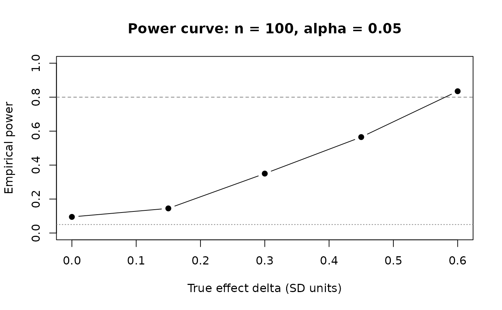

# Example 1: Two arm \| Fixed design \| Continuous

``` r
library(rxsim)
```

This example simulates a parallel-group trial evaluating a new treatment
against placebo on a continuous primary endpoint (e.g., a biomarker
score). 100 subjects are randomised 1:1; a two-sample t-test is run at
full enrollment. This is the simplest complete rxsim workflow using the
generator API (`replicate_trial`). For a side-by-side comparison see
[Two API
Styles](https://boehringer-ingelheim.github.io/rxsim/articles/api-styles.md).

**Unique focus:** generator API, `enroll_trigger`, single final
analysis.

## Scenario

``` r
sample_size   <- 100
arms          <- c("pbo", "trt")
allocation    <- c(1, 1)
delta         <- 0.2              # true effect (SD units)
enrollment_fn <- function(n) rexp(n, rate = 1)
dropout_fn    <- function(n) rexp(n, rate = 0.01)

scenario <- tidyr::expand_grid(
  sample_size = sample_size,
  allocation  = list(allocation),
  delta       = delta
)
```

[`tidyr::expand_grid()`](https://tidyr.tidyverse.org/reference/expand_grid.html)
embeds design parameters into every result row, making results
self-documenting across parameter sweeps.

## Populations

``` r
population_generators <- list(
  pbo = function(n) data.frame(id = 1:n, value = rnorm(n),       readout_time = 1),
  trt = function(n) data.frame(id = 1:n, value = rnorm(n, delta), readout_time = 1)
)
```

`readout_time = 1` means the endpoint is observed 1 time unit after
enrollment. The treatment arm has a mean shift of `delta` SD units over
placebo.

## Conditions

`enroll_trigger(1.0, sample_size)` fires once all 100 subjects are
enrolled. `subset(!is.na(enroll_time))` removes subjects allocated but
not yet arrived.

``` r
analysis_generators <- list(
  final = list(
    trigger  = enroll_trigger(1.0, sample_size),
    analysis = function(df, current_time) {
      enrolled <- subset(df, !is.na(enroll_time))
      tt <- t.test(value ~ arm, data = enrolled)
      data.frame(
        scenario,
        n_total  = nrow(enrolled),
        mean_pbo = mean(enrolled$value[enrolled$arm == "pbo"]),
        mean_trt = mean(enrolled$value[enrolled$arm == "trt"]),
        p_value  = unname(tt$p.value)
      )
    }
  )
)
```

## Simulate

``` r
set.seed(1)
trials <- replicate_trial(
  trial_name            = "example_1",
  sample_size           = sample_size,
  arms                  = arms,
  allocation            = allocation,
  enrollment            = enrollment_fn,
  dropout               = dropout_fn,
  analysis_generators   = analysis_generators,
  population_generators = population_generators,
  n                     = 5
)
```

``` r
run_trials(trials)
```

``` r
replicate_results <- collect_results(trials)
replicate_results
#>   replicate timepoint analysis sample_size allocation delta n_total
#> 1         1 103.06764    final         100       1, 1   0.2     100
#> 2         2  92.31422    final         100       1, 1   0.2     100
#> 3         3  99.24642    final         100       1, 1   0.2     100
#> 4         4  97.35127    final         100       1, 1   0.2     100
#> 5         5  88.55348    final         100       1, 1   0.2     100
#>       mean_pbo    mean_trt    p_value
#> 1  0.045428681 -0.05750340 0.63276693
#> 2  0.165734782  0.37622944 0.31909651
#> 3 -0.084837273  0.34680836 0.04216036
#> 4 -0.040567153  0.36342008 0.05522026
#> 5 -0.003517792  0.09095731 0.68005151
```

`p_value` varies across replicates because each replicate draws
independent random data and a fresh enrollment schedule.

## Power curve

Running 500 replicates across a range of `delta` values reveals how
power scales with effect size for n = 100 at alpha = 0.05.

``` r
set.seed(42)
deltas     <- seq(0, 0.6, by = 0.15)
n_reps_pw  <- 200

power_df <- do.call(rbind, lapply(deltas, function(d) {
  sc <- tidyr::expand_grid(sample_size = sample_size, delta = d)
  pop_gens <- list(
    pbo = function(n) data.frame(id = 1:n, value = rnorm(n),  readout_time = 1),
    trt = function(n) data.frame(id = 1:n, value = rnorm(n, d), readout_time = 1)
  )
  an_gens <- list(final = list(
    trigger  = enroll_trigger(1.0, sample_size),
    analysis = function(df, t) {
      e <- subset(df, !is.na(enroll_time))
      data.frame(sc, p_value = t.test(value ~ arm, data = e)$p.value)
    }
  ))
  tr <- replicate_trial("pw", sample_size, arms, allocation,
                        enrollment_fn, dropout_fn, an_gens, pop_gens, n_reps_pw)
  invisible(run_trials(tr))
  data.frame(delta = d, power = mean(collect_results(tr)$p_value < 0.05))
}))
```

``` r
plot(power_df$delta, power_df$power, type = "b", pch = 19,
     xlab = "True effect delta (SD units)", ylab = "Empirical power",
     main = "Power curve: n = 100, alpha = 0.05",
     ylim = c(0, 1))
abline(h = 0.80, lty = 2, col = "grey50")
abline(h = 0.05, lty = 3, col = "grey50")
```



## Next steps

- [Example
  2](https://boehringer-ingelheim.github.io/rxsim/articles/example-2.md) -
  adds a second endpoint
- [Conditions and
  Triggers](https://boehringer-ingelheim.github.io/rxsim/articles/conditions.md) -
  in-depth guide to multi-look designs
- [Population](https://boehringer-ingelheim.github.io/rxsim/articles/class-population.md) -
  endpoint data shapes for continuous, binary, and time-to-event
  outcomes
